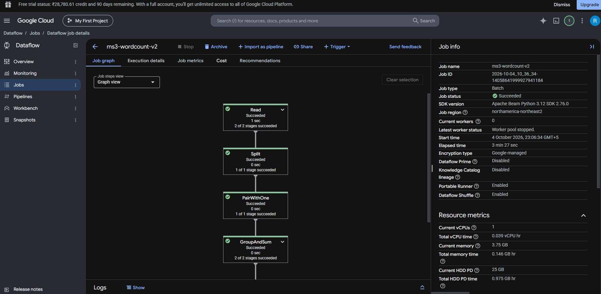
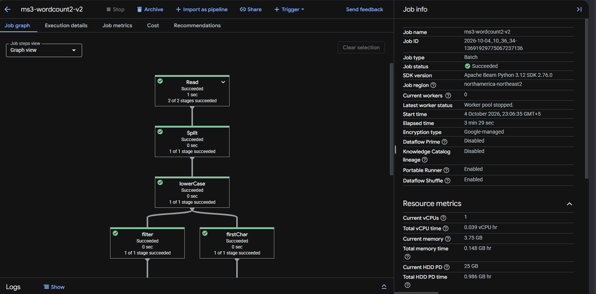
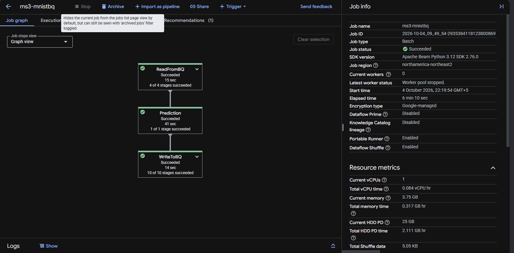
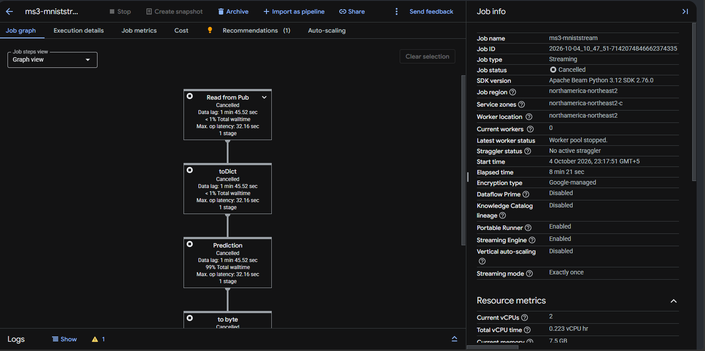
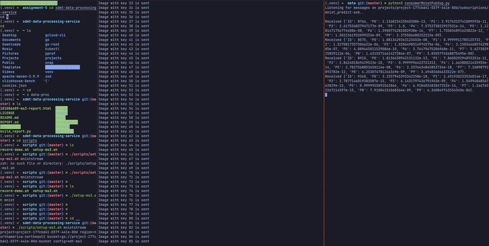
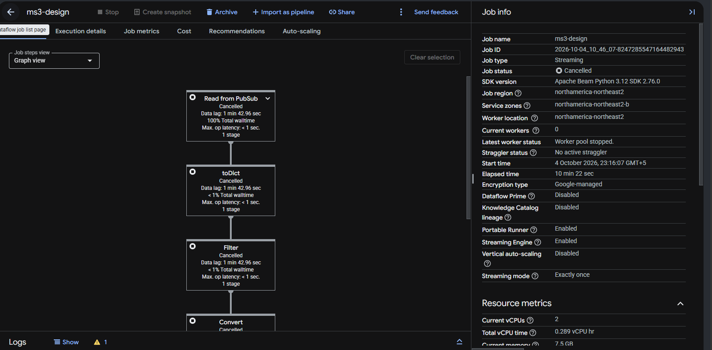
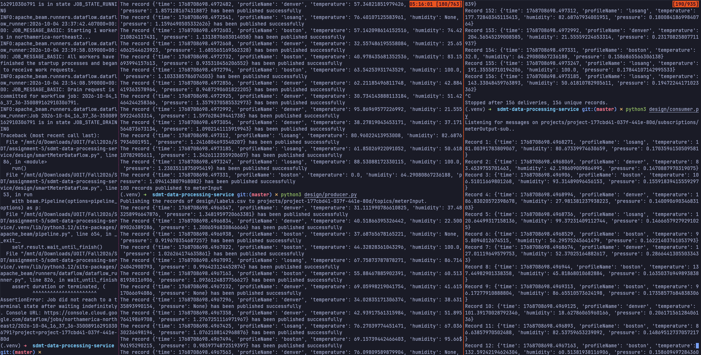

# Milestone 3: Data Processing Service (Dataflow)

**Course:** ENGR 5520G, Software Development Methods and Tools

**Student:** Rohan Muslekar

**Student ID:** 101006689

**GCP project:** `project-177cbd41-037f-441e-80d`

## Deliverable links

| Item | Link |
| --- | --- |
| Scripts used in the Design part | [github.com/Rohan-Muslekar/sdmt-data-processing-service/tree/master/design](https://github.com/Rohan-Muslekar/sdmt-data-processing-service/tree/master/design) |
| Full repository | [github.com/Rohan-Muslekar/sdmt-data-processing-service](https://github.com/Rohan-Muslekar/sdmt-data-processing-service) |
| Video 1, four examples (wordcount and MNIST), about 4 minutes | [Open in Google Drive](https://drive.google.com/file/d/1CIae5ep-PQcYTsrfxKeN8C4JHcwvV5fF/view?usp=sharing) |
| Video 2, design part, about 5 minutes | [Open in Google Drive](https://drive.google.com/file/d/1781HzMn_MmHuPq5MpBA6BXZ2tmKepWJN/view?usp=sharing) |

---

## 1. Background: Dataflow and MapReduce

**Dataflow** is a managed service on Google Cloud that runs Apache Beam pipelines. A Beam pipeline is a directed graph of stages: each stage takes a collection of elements, applies a transform, and passes a new collection to the next stage. Dataflow reads that graph, provisions worker nodes, assigns a transform to each worker, and scales the number of workers up or down to meet throughput. The same pipeline can run in two modes: **batch**, over a bounded source such as a file or a table, and **streaming**, over an unbounded source such as a Pub/Sub topic, where the job runs until it is stopped.

**MapReduce** is the pattern most of these pipelines follow. A **Map** stage takes one input element and emits one or more outputs independently of the other elements, so it parallelizes cleanly. A **Reduce** stage groups the mapped outputs by key and combines the values for each key into a single result. Word count is the canonical example: map each line to its words and pair each word with the count 1 (Map), then group by the word and sum the counts (Reduce).

The four examples below move from a plain batch MapReduce to a streaming machine-learning pipeline, and the design job at the end applies the same pattern to clean smart meter data.

---

## 2. The four Dataflow examples

### 2.1 Word count

`wordcount/wordcount.py` is the stock Apache Beam example. Its pipeline has these stages:

- **Read**: read the input text file into a collection of lines.
- **Split**: a `DoFn` that splits each line into words (Map).
- **PairWithOne**: map each word to the key-value pair `(word, 1)` (Map).
- **GroupAndSum**: `CombinePerKey(sum)` groups by word and sums the ones (Reduce).
- **Format** and **Write**: turn each `(word, count)` into a string and write the results to a text file.

The file is read customized by two arguments, `--input` (optional, with a default Shakespeare file) and `--output` (required). The script is part of the `apache-beam` library, so it is copied out of the library folder at run time rather than committed.

### 2.2 Word count 2

`wordcount/wordcount2.py` extends the first example to show branching. After reading and splitting, a `lowerCase` map normalizes every word. The collection `words` then **forks into two branches that run in parallel**:

- Branch 1 (`--output`): filter to words starting with letters a to f, pair with one, group and sum, and write the word frequencies.
- Branch 2 (`--output2`): take the first letter of each word, pair with one, group and sum, and write the letter-frequency distribution.

Both branches read from the same `words` collection, so Dataflow runs them concurrently and writes two separate output files.

### 2.3 MNIST batch processing (BigQuery)

`mnist/mnistBQ.py` runs a TensorFlow model over the MNIST handwritten-digit dataset in batch. The MNIST CSV is loaded into a BigQuery table `MNIST.Images`; each row is an ID and a 28x28 image flattened to a comma-separated string. The pipeline has three stages:

- **ReadFromBQ**: read every row from `MNIST.Images`.
- **Prediction**: a `PredictDoFn` runs the model on each image and returns a dictionary `{ID, P0, ..., P9}`, where `Pi` is the probability that the digit is `i`. A `@singleton` decorator builds the model once per worker instead of once per row, which keeps the per-element work fast.
- **WriteToBQ**: write the predictions to a new table `MNIST.Predict`.

TensorFlow is installed on each worker through `--setup_file ./setup.py`, and the model parameters are read from the Cloud Storage bucket passed as `--model`.

### 2.4 MNIST stream processing (Pub/Sub)

`mnist/mnistPubSub.py` runs the same model as a streaming job over Pub/Sub. Its pipeline has five stages:

- **Read from Pub/Sub**: consume messages from the input topic `mnist_image`.
- **toDict**: deserialize each message from bytes (JSON) to a dictionary.
- **Prediction**: the same `PredictDoFn` as the batch example.
- **to byte**: serialize each prediction back to JSON bytes.
- **to Pub/sub**: publish the result to the output topic `mnist_predict`.

Because it is marked `--streaming`, the job runs continuously. A local producer feeds images into `mnist_image` and a local consumer reads predictions off `mnist_predict`; both are described in Section 5.

---

## 3. Examples and results

Every job was run with `DataflowRunner` in region `northamerica-northeast2`. The exact commands are in the Appendix and in `scripts/setup-ms3.sh`.

### 3.1 Word count result

The job finished with `JOB_STATE_DONE`. The pipeline graph shows the Read, Split, PairWithOne, GroupAndSum, Format and Write stages. The output file under `result/wordcount/outputs` in the bucket lists each word with its total count.




### 3.2 Word count 2 result

The graph shows the single `words` stage forking into the two parallel branches. Two files were written: `result/wordcount2/outputs` with the a-to-f word counts and `result/wordcount2/outputs2` with the first-letter distribution.




### 3.3 MNIST batch result

The batch job read `MNIST.Images`, ran the model, and created `MNIST.Predict`. The result table holds one row per image with the ID and the ten probabilities P0 to P9; the digit with the highest probability is the model's prediction.




### 3.4 MNIST stream result

The streaming job stayed in the Running state. With the producer publishing images to `mnist_image`, the consumer printed a prediction for each image off `mnist_predict` in real time. The job was stopped manually at the end.





---

## 4. Design part: smart meter preprocessing job

### 4.1 Problem and steps

In the previous milestone the smart meter readings were published to Pub/Sub and stored as received. Those readings carry raw units (pressure in kilopascals, temperature in Celsius) and some rows are incomplete because a meter did not report every measurement. The design job adds a Dataflow stage between the raw topic and the consumer that drops the incomplete rows and converts the units, so that downstream services receive only clean, consistent readings.

The steps taken were:

1. Reuse the smart meter readings from Milestone 2 as `design/Labels.csv`. Each row is `time, profileName, temperature, humidity, pressure`; a blank cell is a missing measurement.
2. Write a producer that publishes each CSV row to the input topic `meterInput`, turning blank cells into JSON `null`.
3. Write the Dataflow job `design/smartMeterDataflow.py` that reads `meterInput`, filters and converts, and writes to `meterOutput`.
4. Write a consumer that reads the cleaned readings off `meterOutput` and prints them.
5. Create the two topics and the `meterOutput-sub` subscription, launch the streaming job, and run the producer and consumer to verify the results.

### 4.2 The Dataflow job

`design/smartMeterDataflow.py` is a streaming pipeline with four stages:

- **Read from PubSub**: consume readings from `meterInput`.
- **Filter**: drop any record that has a missing field. `is_complete` returns true only when every value is not `None`.
- **Convert**: `convert` returns a new record with the pressure changed from kPa to psi and the temperature from Celsius to Fahrenheit, using

  P(psi) = P(kPa) / 6.895

  T(F) = T(C) * 1.8 + 32

  The remaining fields (`time`, `profileName`, `humidity`) pass through unchanged.
- **Write to PubSub**: publish the cleaned record to `meterOutput`.

The core of the script:

```python
KPA_PER_PSI = 6.895

def is_complete(record):
    return all(value is not None for value in record.values())

def convert(record):
    out = dict(record)
    out["pressure"] = record["pressure"] / KPA_PER_PSI
    out["temperature"] = record["temperature"] * 1.8 + 32
    return out

with beam.Pipeline(options=pipeline_options) as p:
    (p
     | "Read from PubSub" >> beam.io.ReadFromPubSub(topic=known_args.input)
     | "toDict" >> beam.Map(lambda b: json.loads(b.decode("utf-8")))
     | "Filter" >> beam.Filter(is_complete)
     | "Convert" >> beam.Map(convert)
     | "to byte" >> beam.Map(lambda x: json.dumps(x).encode("utf-8"))
     | "Write to PubSub" >> beam.io.WriteToPubSub(topic=known_args.output))
```

The transform logic is checked offline with `python design/smartMeterDataflow.py --selftest`, which asserts that a complete record converts correctly (for example 68.95 kPa becomes 10.0 psi and 100 C becomes 212 F) and that a record with a missing field is filtered out.

### 4.3 Successful implementation

The job was launched with `scripts/setup-ms3.sh design` and reached the Running state as a streaming pipeline. Its graph shows the four stages above.



With the producer publishing `Labels.csv` to `meterInput`, the consumer received the converted readings on `meterOutput`. For example, the Denver reading of 31.11 C and 1.348 kPa arrived as about 88.0 F and 0.196 psi. Rows that had a blank measurement in the CSV never reached `meterOutput`, which confirms the filter stage.


---

## 5. Publisher and subscriber

The design part uses a local publisher and subscriber around the Dataflow job.

**Publisher** (`design/producer.py`): reads `design/Labels.csv`, turns each row into a record, converts blank numeric cells to `None`, and publishes the record to `meterInput`. Message ordering is enabled with `profileName` as the ordering key so that all readings of one device arrive in publish order.

**Subscriber** (`design/consumer.py`): subscribes to `meterOutput-sub`, deserializes each message, and prints it. It tracks `message_id` values to flag any redelivery, since Pub/Sub guarantees at-least-once delivery, and guards the shared counters and printing with a lock because the streaming pull runs the callback on several threads.

Both find the service account key JSON in the current directory automatically, so the key is never written into the source. Running the two against the job is shown in Video 2.



---

## Appendix: commands used

Environment, scoped to the `sdt-a2` gcloud config:

```bash
export CLOUDSDK_ACTIVE_CONFIG_NAME=sdt-a2
PROJECT=$(gcloud config list project --format "value(core.project)")
BUCKET=gs://$PROJECT-bucket
```

Word count (example 1):

```bash
python wordcount.py \
  --region northamerica-northeast2 --runner DataflowRunner --project $PROJECT \
  --temp_location $BUCKET/tmp/ \
  --input gs://dataflow-samples/shakespeare/winterstale.txt \
  --output $BUCKET/result/wordcount/outputs \
  --experiment use_unsupported_python_version
```

Word count 2 (example 2) writes to `$BUCKET/result/wordcount2/outputs` and adds `--output2 $BUCKET/result/wordcount2/outputs2`.

MNIST batch (example 3):

```bash
python mnistBQ.py \
  --runner DataflowRunner --project $PROJECT \
  --staging_location $BUCKET/staging --temp_location $BUCKET/temp \
  --model $BUCKET/model --setup_file ./setup.py \
  --input $PROJECT.MNIST.Images --output $PROJECT.MNIST.Predict \
  --region northamerica-northeast2 --experiment use_unsupported_python_version
```

MNIST stream (example 4) uses topics and `--streaming`:

```bash
python mnistPubSub.py \
  --runner DataflowRunner --project $PROJECT \
  --staging_location $BUCKET/staging --temp_location $BUCKET/temp \
  --model $BUCKET/model --setup_file ./setup.py \
  --input projects/$PROJECT/topics/mnist_image \
  --output projects/$PROJECT/topics/mnist_predict \
  --region northamerica-northeast2 --experiment use_unsupported_python_version --streaming
```

Design job:

```bash
python design/smartMeterDataflow.py \
  --region northamerica-northeast2 --runner DataflowRunner --project $PROJECT \
  --temp_location $BUCKET/tmp/ --staging_location $BUCKET/staging \
  --input projects/$PROJECT/topics/meterInput \
  --output projects/$PROJECT/topics/meterOutput \
  --experiment use_unsupported_python_version --streaming
```

Local publisher and subscriber (service account key JSON in the current folder):

```bash
python design/producer.py
python design/consumer.py
```
